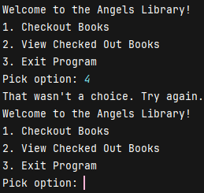

A console-based library management system built in Java.
This project demonstrates the implementation of basic object-oriented programming concepts, 
such as classes, arrays, and handling user input through the terminal. 
The system allows users to interact with books, check them out, return them, and view their status.

------------------------------------------------------------------------------------------------------

Features
View Available Books: See a list of books that are currently available for checkout.
Check Out Books: Borrow a book by entering the book's ID and providing your name.
View Checked Out Books: View books that have been checked out and see who has borrowed them.
Return Books: Return a checked-out book by entering the book's ID.
Simple User Interface: A text-based menu for easy navigation and interaction.

------------------------------------------------------------------------------------------------------

Prerequisites
To run this project, ensure that you have the following:
Java Development Kit (JDK) 8 or higher installed on your machine.
A Java Integrated Development Environment (IDE) such as IntelliJ IDEA, Eclipse, or Visual Studio Code. 
Alternatively, you can use the terminal.

------------------------------------------------------------------------------------------------------

With Maven
Run the following command to build the JAR file using Maven:
```mvn clean package```

After the project is packaged, run the JAR file with this command:
```java -cp target/library-management-system-1.0-SNAPSHOT.jar com.pluralsight.Main```

------------------------------------------------------------------------------------------------------

Without Maven
Compile the Code into an Output Folder
```javac -d out src/com/pluralsight/Main.java src/com/pluralsight/Book.java```

Run the Main Class from the Compiled Output
```java -cp out com.pluralsight.Main```

How the Program Works
Main Program:
The Main.java class handles the core functionality of the program. It presents a menu to the user with options to view available books, view checked out books, or exit the application.

Book Class:
The Book.java class defines a Book object, which contains details such as the book's ID, ISBN, title, and checkout status. The Book class also includes methods for checking out and returning books, as well as displaying book information.

------------------------------------------------------------------------------------------------------

Key Methods:
createBooks: Creates an array of 20 Book objects with default data (ID, ISBN, and title).
homeScreen: Displays the main menu to the user and processes their input.
showAvailableBooks: Displays a list of books that are available for checkout.
showCheckedOutBooks: Displays a list of books that have been checked out.
findBookById: Searches for a book by its ID to check its status or perform actions like checkout or return.

------------------------------------------------------------------------------------------------------

IMAGES




Interesting piece of code
ParseInt is super useful because it allows you to convert a String into an integer and that’s something you'll often need 
when working with user input You can’t do math with a string so if you want to use that number in calculations 
you need to convert it into an int it's the go to method when you need to read numeric input from users convert numbers 
stored as text or handle logic or calculations based on user input


License
This project is open source and free to use for educational purposes.

