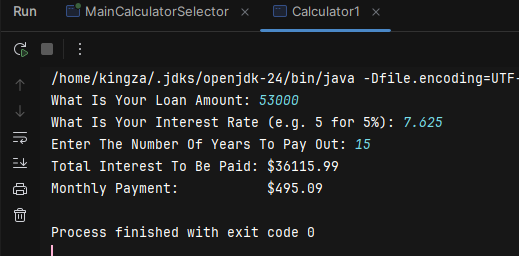
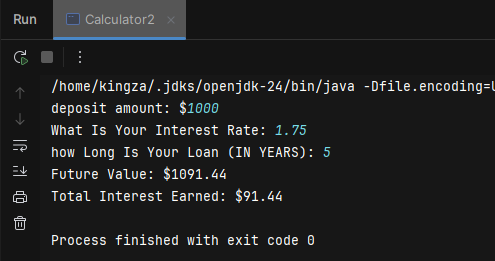
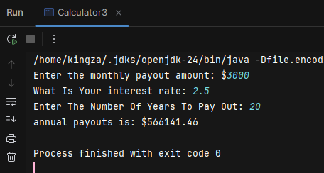
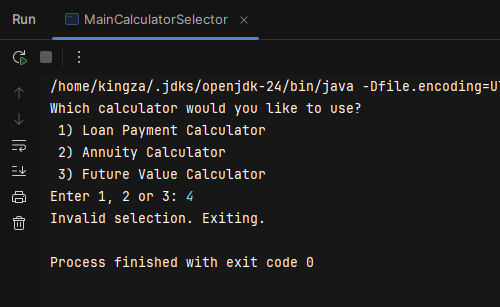
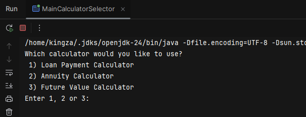

Financial Calculators

A simple Java application that bundles three financial calculators into a single interactive program. 
When ran, the user is prompted to select one of the calculators:

Loan Payment Calculator: Compute monthly payment for a loan given principal, interest rate, and term.
Annuity Calculator: Calculate the present value of an annuity.
Future Value Calculator: Determine the future value of a series of periodic payments.

Prerequisites
Java Development Kit (JDK) 8 or higher

//////////////////////////////////////////////////////////////////////////////////////////

Installation
# Clone the repository
git clone <repo-url>
cd financial-calculators
 
# Compile all Java files to 'out' directory
javac -d out src/main/java/com/pluralsight/*.java

# run
java -cp out com.pluralsight.MainCalculatorSelector
Follow the on‑screen prompt to select which calculator you want to run.

/////////////////////////////////////////////////////////////////////////////////////////

Installation With Maven 
# Clone the repository
git clone <repo-url>
cd financial-calculators

# Build the JAR
mvn clean package

# run
java -jar target/financial-calculators-1.0-SNAPSHOT.jar

///////////////////////////////////////////////////////////////////////////////////

At first glance, the line

import java.util.Scanner;

might look trivial, but it actually brings in the powerful Scanner class from the java.util package
giving us simple methods like nextInt(), nextDouble(), and nextLine() 
for console input without the boilerplate of InputStreamReader or BufferedReader it also shows Java’s 
package‑and‑import system for modular code reuse
Scanner implements Closeable it can be used in a try‑with‑resources block to manage the System.in resource cleanly. 
this is the code I found most interesting.

License
This project is licensed under the MIT License. See the LICENSE file for details.

